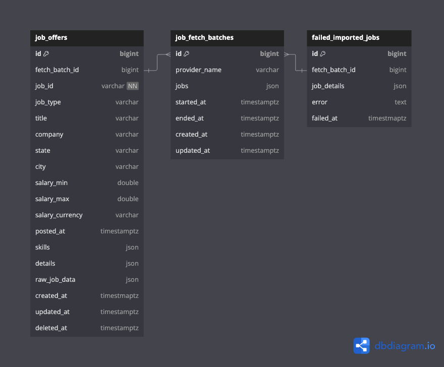

# DeVotel Assessment

## Introduction

This project is an assessment task provided by DeVotel. It is a job offer collector that fetches data from different
providers, transforms them into a unified structure, and stores them in a database. The system is designed to support
multiple providers.

## Installation

This project can be run locally or via Docker.

### Running the project using Docker

1. **Set environment variables:**

   - Create a `.env` file based on `.env.example`.
   - Fill in all required variables.

2. **Run the project:** (Ensure Docker is up and running on your machine)

   ```bash
   docker compose --profile all up -d --build
   ```

### Running the project locally using Node.js

Make sure you have a working Node.js installation.

```bash
# Install dependencies
npm install

# Start in production mode
npm run build
npm run start:prod

# Start in development mode
npm run start:dev
```

The application will be accessible on port **3000**.

## Running migrations

This project uses **Sequelize-cli** for database management. you need to run migrations to create the database schema.

You need to run the following command:

```bash
npm run db:migrate

# using docker
docker compose run --rm npm run db:migrate
```

You can also undo migrations using the following command:

```bash
npm run db:migrate:undo
```

Checkout `package.json` file for more database migration commands.

## Database Documentation

This project uses a **PostgreSQL** database. You need a running PostgreSQL instance to use the project.

The **ERD diagram** is available at `./docs/db/devotel-job-offer-task-db-design.png`:



### Database Tables

- **`job_offers`**: Stores all job offers in the system.
- **`job_fetch_batches`**: Stores job fetch batch every time requesting jobs from job-providers.
- **`failed_imported_jobs`**: Stores jobs that failed to import (for example due to a database validation error).

## API Documentation

API documentation is available via Swagger or a Postman collection:

- **Swagger:** Available at `/docs`
- **Postman Collection:** [postman_collection.json](./docs/postman/Devotel_Assessment_test.postman_collection.json)

## Job Fetching Process

A **cron job** runs periodically to fetch jobs from all providers and store them in the database. You can configure the
interval in the `.env` file by setting the `JOB_FETCHING_CRON_EXPRESSION` variable.

The cron job is implemented in:

```
src/modules/job-fetching/schedulers/job-fetching.scheduler.ts
```

## Job Providers

The project supports fetching jobs from different providers with different schema. A provider data must be transformed
into a unified structure before storing in the system. For each provider we have to implement a separate ProviderClass.

### How to Add a New Provider

1. **Create a provider class** that implements the `JobProviderInterface` located at:
   ```
   src/modules/job-fetching/interfaces/job-provider.interface.ts
   ```
2. **Register the provider** in `job-fetching.module.ts`.
3. **Add the provider** to the `providers` array in `job-fetching.service.ts`.
4. **Store provider metadata** (name and URL) in `job-providers.config.ts` for better code management.

## Project Structure

```
└───app
    ├───.husky
    ├───database
    ├───docs
    │   └───postman
    │   └───db
    ├───logs
    │   └───app.log
    ├───public
    ├───src
    │   ├───config
    │   ├───i18n
    │   ├───lib
    │   └───modules
    │       └───MODULE_NAME
    ├───test
```

### Directory Overview

- **`.husky/`**: Contains [Husky](https://github.com/typicode/husky) hooks.
- **`database/`**: Contains Sequelize migrations and seeders.
- **`docs/`**: Stores documentation files, including Postman collections and database schema.
- **`logs/`**: Stores log files generated by Winston.
- **`src/`**: Contains the source code.
  - **`config/`**: Configuration files and parsed environment variables.
  - **`i18n/`**: JSON files for internationalization.
  - **`lib/`**: Shared utilities like base classes, decorators, exception filters, pipes, and logger modules.
  - **`modules/`**: Project modules, each defined with `MODULE_NAME.module.ts` and containing controllers, services,
    entities, DTOs, and other logic.
- **`test/`**: Contains end-to-end (E2E) tests.

## Packages Used

This project is built with **Node.js (22.10)** and **TypeScript (5.7.3)**. Most important dependencies are:

| Use Case      | Package / Technology                                      |
| ------------- | --------------------------------------------------------- |
| Web Framework | [`NestJS (11)`](https://docs.nestjs.com/)                 |
| Database      | [`PostgreSQL (16)`](https://www.postgresql.org/)          |
| ORM           | [`Sequelize (6)`](https://github.com/sequelize/sequelize) |
| Logging       | [`Winston (3)`](https://github.com/winstonjs/winston)     |

## Linting & Formatting

This project uses **ESLint** and **Prettier**.

To lint and format the code, run:

```bash
npm run lint
npm run format
```

Additionally, **Husky** ensures `eslint --fix` runs on every commit.

## Testing

To run tests, first create a `.env.testing` file by copying `.env.testing.example` and setting the required values.

Tests run in a separate environment using `cross-env`, allowing them to use a dedicated test database.

> You don't like to use `.env.testing`? Don't worry! The tests will run using `.env` file. But NOT RECOMMENDED! Believe
> me :))

Run tests using:

```bash
# Unit tests
npm run test

# E2E tests
npm run test:e2e
```

## To improve

Some potential improvements for this project:

- [ ] Add more unit tests.
- [ ] Add more E2E tests (especially for data filtering and failed tests).
